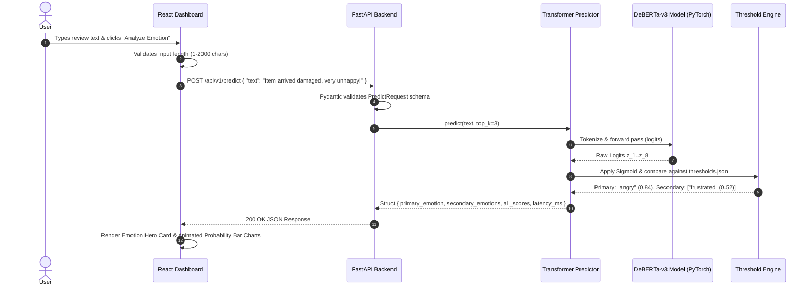
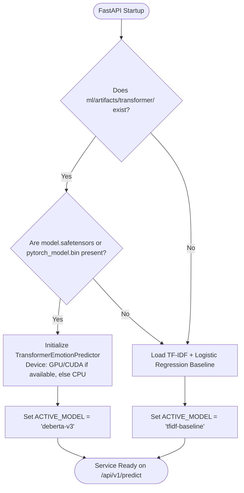
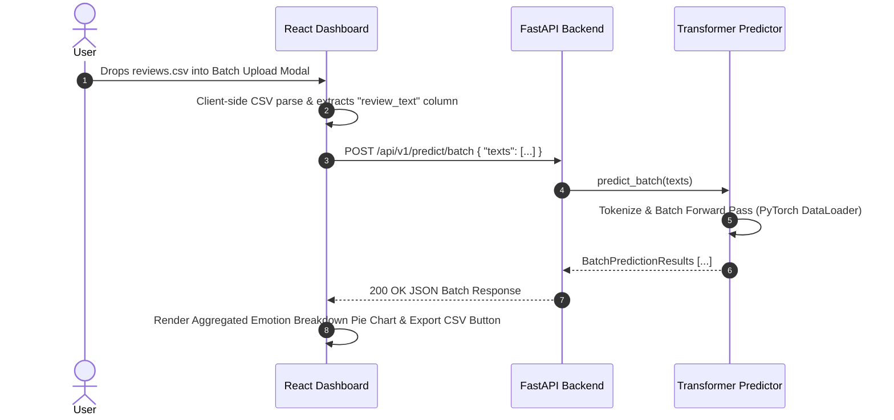

# Review Sense — App Flow & System Workflow Specification

## 1. System Sequence Diagram (Single Text Analysis)

The diagram below illustrates the end-to-end data flow when a user analyzes a review in the frontend dashboard:

---

## 2. Model Selection & Fallback Workflow

When the backend service starts, it runs an automatic model availability check to pick the best available inference engine:

---

## 3. Batch Review CSV Processing Flow

For bulk review processing (e.g. e-commerce feedback uploads):

---

## 4. User Journeys & State Transitions

### Primary Single Review Journey
1. **Initial State:** User lands on dashboard; active model indicator shows `DeBERTa-v3 (Calibrated)`.
2. **Input State:** User enters text or clicks a preset sample chip (*"Fast delivery but the quality is disappointing"*).
3. **Loading State:** Input button shows loading spinner; previous charts fade out.
4. **Success State:** Hero badge displays primary emotion (`sad`), secondary badge displays (`frustrated`), and 8 animated progress bars show exact score percentages.
5. **Error State:** If API returns validation error (e.g. empty string), a red alert banner displays the issue cleanly.

